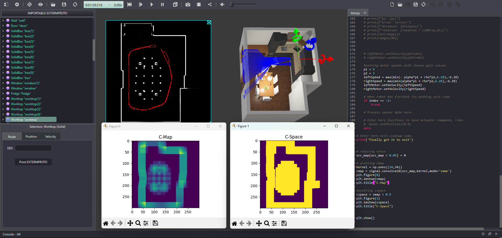

# TiagoLite Autonomous Mapping & Navigation – Kitchen C-Space Project

  

## Overview
This project implements **autonomous mapping and navigation** for a TiagoLite mobile robot in the Webots `kitchen.wbt` environment. The robot:

- Follows a **GPS/compass-based waypoint trajectory** around a dining table (clockwise and counter-clockwise).
- Builds a **probabilistic occupancy grid map** using LIDAR data.
- Uses **convolution-based obstacle growth** to generate a **configuration space (C-Space)** that maximizes clearance from obstacles while preserving a narrow passage to the kitchen work area.

The system drives the robot around the table **twice in under two minutes**, logs its trajectory, constructs a noise-reduced occupancy map, and computes a binary C-Space with a **one-pixel-wide path** through tight areas, matching the full-credit requirement for the assignment.

---

## Personal Contributions

- **Waypoint Tracking & Trajectory Control**  
  - Implemented a **GPS + compass-based controller** that computes:
    - \( $\rho$ \): distance to the next waypoint  
    - \( $\alpha$ \): heading error between robot orientation and desired direction
  - Designed a **proportional controller** on both distance and heading, with speed saturation at the robot’s max wheel speed (±6.28 rad/s).
  - Created a **bidirectional waypoint path** so the robot travels clockwise around the table, then reverses the waypoint list to return counter-clockwise.

- **Probabilistic Occupancy Grid Mapping**  
  - Implemented a **300×300 occupancy grid** to represent the kitchen environment.
  - Projected **667-beam LIDAR measurements** into world coordinates using:
    - LIDAR-to-base-frame translation (accounting for the 0.202 m sensor offset).
    - Robot pose from **GPS + compass** to convert from robot frame → world frame.
  - Updated map cells probabilistically by incrementing occupancy values and clamping them between 0 and 1 to reflect measurement confidence.
  - Filtered invalid LIDAR readings (`Inf`) by replacing them with large dummy distances to avoid false obstacles near the robot.

- **Real-Time Trajectory & Map Visualization**  
  - Used the Webots `Display` device to:
    - Draw the robot’s **trajectory in red** as it moves through the environment.
    - Render the occupancy grid in **grayscale**, where brighter pixels indicate higher occupancy probability.
  - Implemented a dedicated **map data structure** separate from the display to avoid mixing visualization logic with underlying data.

- **C-Space Generation & Obstacle Growth**  
  - Applied a **34×34 convolution kernel** over the occupancy map to “inflate” obstacles according to the robot’s footprint and safety margin.
  - Thresholded the convolved map at **90% occupancy** to create a **binary C-Space**:  
    - `1` → collision / configuration blocked  
    - `0` → free configuration
  - Tuned parameters so the resulting C-Space leaves a **single-pixel-wide passage** in narrow areas, satisfying the optimization requirement.

- **Performance & Validation**  
  - Verified that the TiagoLite **circumnavigates the table twice in under 2 minutes**, meeting timing constraints.
  - Checked that the final C-Space correctly blocks collisions with table legs and chairs while still allowing a feasible path to the kitchen work area.

---

## Tools & Technologies

- **Simulation & Robotics**
  - **Webots** – TiagoLite robot, `kitchen.wbt` environment, LIDAR, GPS, compass, and display setup.
  - **TiagoLite** – Mobile robot platform used for mapping and navigation.

- **Code & Libraries**
  - **Python** – Controller implementation for navigation, mapping, and visualization.
  - **NumPy** – Vectorized math for coordinate transforms, distance and angle calculations, and ray projection.
  - **SciPy (signal)** – Used for 2D convolution to grow obstacles and compute the C-Space map.
  - **Matplotlib** – Generated plots for:
    - Raw occupancy (`cmap`)  
    - Binary configuration space (`cspace`)

---

## Engineering Summary

> This project demonstrates an end-to-end autonomous navigation pipeline in simulation: from **waypoint tracking** and **sensor-based mapping** to **configuration space generation**. The TiagoLite robot uses GPS and compass data to follow a closed-loop trajectory, probabilistically fuses LIDAR measurements into a 300×300 grid, and then inflates obstacles via a 34×34 kernel to compute a safe C-Space. The final system successfully executes two full laps around the table in under two minutes and produces a binary C-Space with a one-pixel-wide navigable corridor, suitable as a foundation for future path planning and GNC extensions.

---

## 📬 Contact
Reach out at **dawi5869@colorado.edu**
